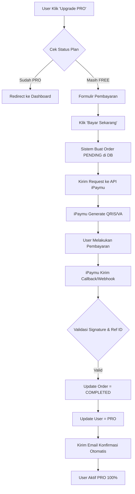
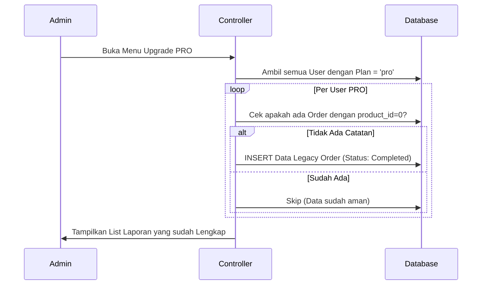

# 💎 The Master Guide: Sistem Upgrade PRO & Reporting Platform
## Lingku.xyz - Premium SaaS Architecture

Dokumentasi ini adalah panduan teknis komprehensif yang mencakup seluruh aspek sistem Upgrade PRO, mulai dari arsitektur backend, integrasi pihak ketiga, hingga manajemen database.

---

## 1. Arus Proses Visual (System Diagrams)

### A. Alur Transaksi User (Flowchart)


### B. Alur Sinkronisasi Data (Auto-Sync Logic)


---

## 2. Bedah Teknis Backend (Code Deep Dive)

### A. Inisialisasi Pembayaran (`adminController.js`)
Sistem menggunakan **Direct Payment API v2 iPaymu** untuk memberikan pengalaman checkout yang cepat.
- **Endpoint:** `payment/direct`
- **Pencatatan Awal:** Data langsung disimpan dengan `status = 'pending'` menggunakan nama kolom yang sesuai dengan database Hostinger (`customer_name`, `customer_email`, `customer_whatsapp`).

**Payload Utama ke iPaymu:**
```json
{
    "name": "Nama User",
    "email": "Email User",
    "amount": 99000,
    "referenceId": "UPGRADE-PRO-123-1715000000",
    "notifyUrl": "https://lingku.xyz/api/callback/ipaymu",
    "paymentMethod": "qris",
    "product": ["Upgrade PRO Lingku"],
    "qty": [1]
}
```

### B. Validasi Webhook (`builderController.js`)
Ini adalah bagian paling krusial untuk keamanan. Sistem memverifikasi setiap sinyal masuk dari iPaymu menggunakan `sid` (Reference ID).

**Logika Update Status:**
1. Mencari order dengan `reference_id` dan `product_id = 0`.
2. Jika ditemukan, status diubah ke `completed`.
3. Jika tidak ditemukan (misal: log checkout gagal), sistem melakukan **Fallback INSERT** agar transaksi tetap tercatat di laporan.

---

## 3. Struktur Database (Schema Mapping)
Sistem ini menggunakan tabel `orders` yang sudah disesuaikan dengan struktur asli database Anda:

| Nama Kolom | Tipe Data | Peran |
| :--- | :--- | :--- |
| `id` | INT (PK) | ID Unik database. |
| `user_id` | INT | Diisi **1** (Admin) untuk memisahkan dana platform. |
| `product_id` | INT | Diisi **0** (Identitas khusus Paket PRO). |
| `reference_id` | VARCHAR | ID unik transaksi (UPGRADE-PRO-...). |
| `customer_name` | VARCHAR | Nama lengkap pembeli. |
| `customer_email` | VARCHAR | Email pembeli untuk kirim nota. |
| `customer_whatsapp`| VARCHAR | No HP untuk follow up manual jika perlu. |
| `total_price` | DECIMAL | Nominal pembayaran (misal: 99000). |
| `status` | VARCHAR | `pending`, `completed`, atau `expired`. |
| `payment_channel` | VARCHAR | Metode yang digunakan (QRIS/VA). |
| `created_at` | TIMESTAMP | Waktu transaksi dibuat. |

---

## 4. UI/UX Manajemen Admin
### A. Menu Sidebar
Terdapat menu baru **"Upgrade PRO"** dengan ikon `fa-crown` berwarna emas. Menu ini hanya dapat diakses oleh user dengan role `admin`.

### B. Laporan Penjualan Platform (`upgrade-orders.ejs`)
Tampilan laporan menggunakan **Design System Premium**:
- **Badge Status:** Dinamis (Hijau untuk lunas, Orange untuk pending).
- **Avatar Inisial:** Mempermudah identifikasi pembeli secara visual.
- **Detail Invoice:** Menampilkan Reference ID dan Metode Pembayaran secara transparan.

---

## 5. Keamanan & Troubleshooting
### A. Keamanan Signature
Setiap komunikasi dengan iPaymu dilindungi oleh **SHA256 HMAC Signature** menggunakan API Key Admin yang tersimpan aman di environment variable.

### B. Penanganan Masalah (Common Issues)
1. **User sudah bayar tapi belum PRO?**
   - Cek halaman **Upgrade PRO**. Jika status masih *Pending*, berarti callback iPaymu terhambat. Klik refresh halaman untuk menjalankan *Auto-Sync*.
2. **Data tidak muncul di list?**
   - Pastikan Anda sedang login sebagai Admin. Sistem memfilter data berdasarkan `product_id = 0`.
3. **Database Error?**
   - Sistem sudah dikalibrasi untuk menggunakan nama kolom `customer_*`. Pastikan tabel `orders` di Hostinger tidak mengalami perubahan struktur secara manual.

---

## 6. Daftar File Terkait (Repository Map)
- 📁 `routes/admin.js` -> Definisi Route `/upgrade-orders`
- 📁 `controllers/adminController.js` -> Logika Bisnis & Sinkronisasi
- 📁 `controllers/builderController.js` -> Handler Webhook Pembayaran
- 📁 `views/admin/upgrade-orders.ejs` -> Interface Laporan Keuangan
- 📁 `views/layouts/admin.ejs` -> Navigasi Sidebar Admin
- 📁 `views/admin/orders.ejs` -> Clean-up (Pemisahan Penjualan User)

---
**Status Final:** ✅ Teruji & Siap Digunakan
**Update Terakhir:** 7 Mei 2026
**Arsitek:** Antigravity AI Assistant
